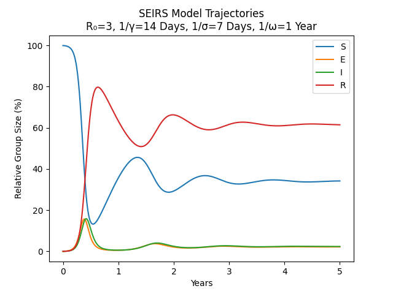
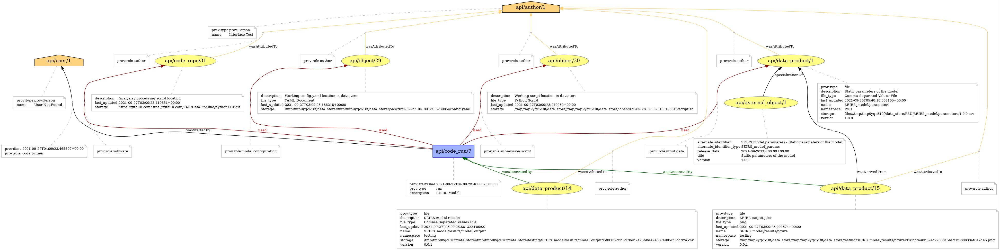

SEIS Model example
==================

.. toctree::
   :maxdepth: 2
   :caption: Contents:

The following example illustrates how to run the `SEIRS Model <https://doi.org/10.1038/s41592-020-0856-2>`_ using the Fair Data Pipeline with the :code:`pyDataPipeline` package.

config.yaml
-----------
The user should supply a config.yaml file describing a code run with the following inputs:
::

   SEIRS_model/parameters

and the following outputs:
::

   SEIRS_model/results/model_output
   SEIRS_model/results/figure

an example config is provided within the pyDataPipeline package located in :code:`src/org/simpleModel/ext/SEIRSconfig.yaml`
and contains the following:

.. literalinclude:: /../../src/org/fairdatapipeline/simpleModel/ext/SEIRSconfig.yaml
   :linenos:
   :language: yaml

The script specified in :code:`run_metadata` will be called by :code:`fair run`

fair pull
---------

Using the CLI tool, the command :code:`fair pull` will indetify any data products listed in the :code:`register` field of the config.yaml file and
download them to the local data store as set by :code:`fair init` and register the corresonding metadata to the local registry.

The following commands should be run after activating a poetry shell from the CLI tool:
::

   fair init --ci
   fair pull scr/org/fairdatapipeline/simpleModel/ext/SEIRSconfig.yaml

The :code:`--ci` flag can be used to use temporary directories. If using this flag the above code should be run from the :code:`local_repo` directory

Once the :code:`fair pull` command has been run the following data product should now be stored in the local registry

#. :code:`SEIRS_model/parameters`

fair run
--------

In order to run the script specified in :code:`run_metadata['script']` field of the config.yaml the command :code:`fair run` from the CLI Tools should be used, 
Once again if the :code:`--ci` flag was used with the :code:`fair init` command then this must be from the :code:`local_repo` directory.
This should also only be run after activating a poetry shell from the command line and installing the :code:`pyDataPipeline` package within the poetry virtual environment
following the `Installation <../installation.html>`_ instructions.
::

   fair run src/org/fairdatapipeline/simpleModel/ext/SEIRSconfig.yaml

This will call :code:`fair run` which will produce a code run and the appropriate output using the script provided in the :code:`run_metadata` field of the config.yaml file.

The following code will be executed when using the :code:`src/org/fairdatapipeline/simpleModel/ext/SEIRSconfig,yaml` config file,
which is located in the :code:`src/org/fairdatapipeline/simpleModel/ext/SEIRSModelRun.py` Python script

.. literalinclude:: /../../src/org/fairdatapipeline/simpleModel/ext/SEIRSModelRun.py
   :linenos:
   :language: python

Output
------

This code run should produce the following figure in the local data store,
this will be a tempory directory if the :code:`--ci` flag was used with :code:`fair init`

As well as the above figure a CSV file from the model output which will also be located within the local data store
an example of the CSV file is printed below:

.. rst-class:: table-limit

.. csv-table:: Output
   :file: SEIRS_output.csv
   :header-rows: 1
   :align: left

Provenance Report
-----------------

The following is the Provenance Report produced by the FAIR Data Pipeline Registry as a result of the above code run:

